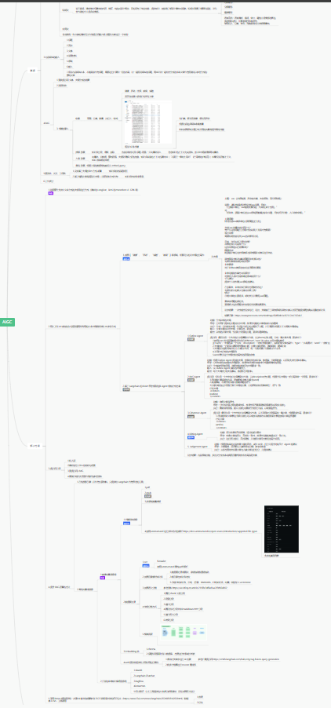

# 自我介绍
* 一个有梦想的咸鱼，一个有灵魂的机器人

## 自己做过/参与过最牛逼的产品是什么？
    
* [Metersphere（主程）](https://github.com/metersphere/metersphere) 
* [RackShift（独立完成）](https://github.com/fit2cloud/rackshift)
* [AIGC 工厂](http://47.121.183.184:8081/aigc_html#/)
* [接口测试 IDEA 插件](https://github.com/metersphere/metersphere-idea-plugin)
* [运维神器 WebKVM](https://github.com/rackshift/webkvm)
* [Web语音助手](https://voice.julianschoen.co/)

## 在职业道路上，做过最疯狂的事情是什么？
* 放弃稳定工作，全职投入独立开源项目开发，哪怕风险极高，哪怕最后失败了。
* 在关键时刻拍板一个大胆的决策，比如推翻整个产品方案，只因为发现了更好的方向。
* 在工作中挑战权威，提出不同意见，即使大多数人当时并不理解，并最终证明我是对的。

## 日常工作中，怎么使用AI?
* Prompt Engineering、快速脑图、快速查看论文、实体识别、关系提取、摘要等
  
* AIGC （主业）
* 使用 Copilot 或者 continue 本地或者 SAAS 工具辅助 Coding
* 使用 GPT 快速结构化原始数据、Prompt Engineering、使用 StableDiffusion、Flux 等生成需要图片
* 使用 Coze 或者 Dify 等快速搭建比如获取每日信息并使用微信机器人发送群消息的 Agent
* 使用 ScreenshotToCode 利用 vision 模型快速复制网站
* 使用 DeepSeek 的 COT 完成复杂问题的研究，比如 3D 预训练的解决方案
* 总的来说基本都是 ChatBox、智能客服、图像生成、声音合成、搭建 Agent
* 使用 Langchain 或者 LlamaIndex 等 Multi-Agent 框架快速搭建多模态、自省 Agent 程序完成业务需要
* 使用 Langchain + chroma + WrodEmbedding + LLM + Flask + Vue3 等技术栈搭建企业内部私有化的知识库问答系统 

## 你觉得市面上最牛逼的AI产品是什么？
没有最牛只有更牛，从 1956 年的达特茅斯会议开始提出机器也可以产生智能开始。从 L1-L5 的智能驾驶演变路径开始，从 21 年末震惊世界的 ChatGPT 开始，
到后来的 Claude ，到 Kimi 到 Qwen 到现在降低 20 倍成本的 DeepSeek，从 StableDiffusion 1.0 到 XL , 3.0 到 Flux ，从 GPTs 到现在的各种 Agent 到各种 Agent as a service 平台。从 Word2Vec 到现在的多模态到 AGI 到 ASI。我所看到的世界喝李飞飞博士一样方兴未艾。

## 您如何衡量自己在角色中的成功，并为自己在 AI 浪潮中设定哪些大胆的目标？
从 0 - 1 建立一个新兴的产品线并且完成商业闭环或者超出 KPI

## 描述一下你对成功的渴望。
我需要钱

## 怎么看待创业公司 狼性文化 和 高工作压力
非常 nice，我只要钱

## 如果你前老板评价你 会是怎样的评价？
非常 nice、将军、富有激情
